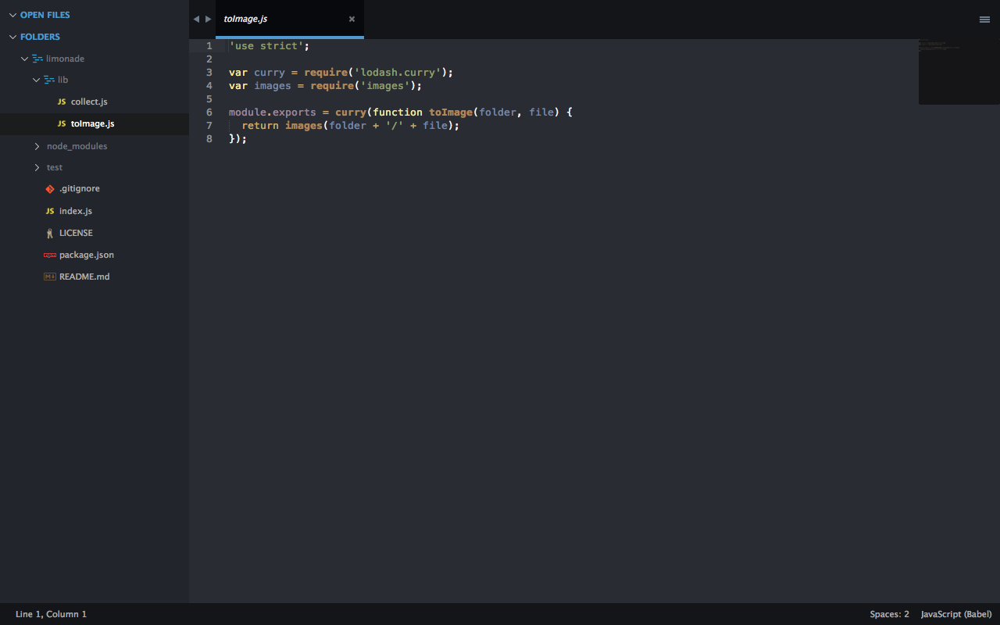

# SuperSeti

My own custom Seti UI. I arranged the colors to have lower contrasts and bluer highlights.

Original Atom's Seti_UI by [jesseweed](https://github.com/jesseweed/seti-ui)

Sublime Text 3 port by [ctf0](https://github.com/ctf0/Seti_ST3)

I'm using a very slightly modified Twilight by Michael Sheets as a color Scheme.




## Install

* Clone this repo to your `Sublime Text 3/Packages` folder.
* Make sure the content of this repo is in a folder named `SuperSeti`.
* In your `Preferences.sublime-setting` file add :
```
  "theme": "SuperSeti.sublime-theme",
  "color_scheme": "Packages/SuperSeti/Scheme/Twilight.tmTheme"
```
